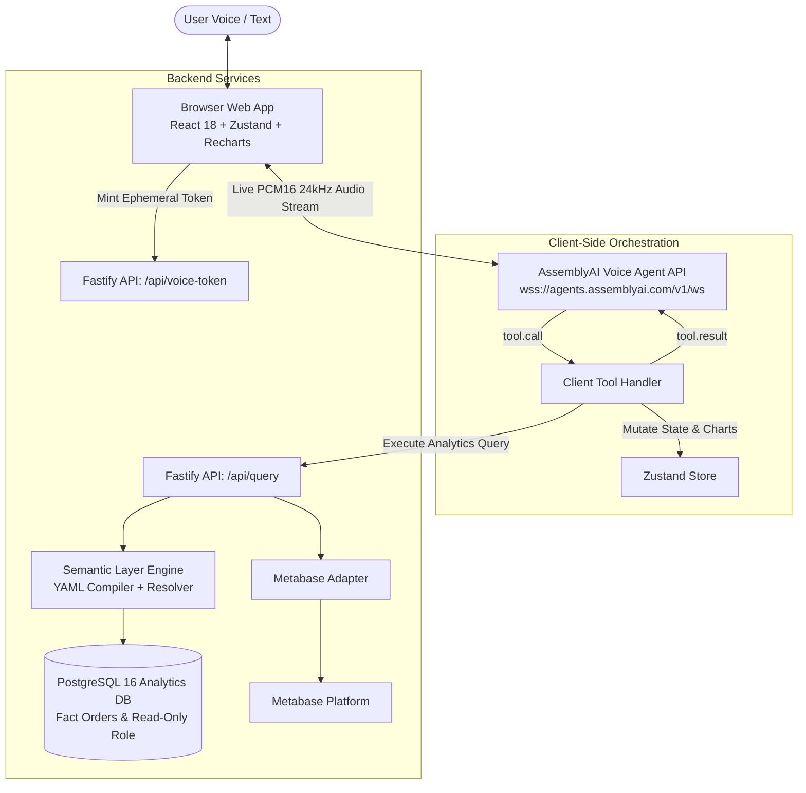

# Talk to Your Data 🎙️📊
> **Voice-Built Live Analytics Dashboards on AssemblyAI**

A user speaks; charts appear, filter, compare, and rearrange on a live responsive dashboard in real time. Built for the **AssemblyAI Voice Agent Hackathon** (Sep 2026).

[](LICENSE)
[](https://www.typescriptlang.org/)
[](https://fastify.dev/)
[](https://react.dev/)
[](https://www.assemblyai.com/)

---

## 🌟 Key Features

- **True Speech-to-Speech Flow**: Browser connects directly to AssemblyAI Voice Agent API via WebSocket with low latency, full duplex turn-taking, and barge-in interruption.
- **Client-Side Tool Calling**: State changes update the UI optimistically within milliseconds while the agent speaks conversational insights.
- **Zero SQL Hallucination**: The LLM never writes raw SQL. User queries compile deterministically through an allowlisted YAML semantic layer.
- **Smart Disambiguation**: Spoken ambiguities (e.g. *"the south"*, *"the store"*, *"SE"*) are automatically resolved against dimensional synonyms or clarified conversationally.
- **Multi-Turn Corrections**: Follow-ups like *"no, weekly not monthly"*, *"break out Southeast"*, or *"compare to last year"* update existing charts rather than starting over.
- **Full Transparency**: Inspect parameterized SQL on every chart with the "Show SQL" toggle.
- **BI Export**: One-click or voice-driven export of dashboards to Metabase as native SQL cards.

---

## 🏗️ Architecture



---

## 🚀 Quickstart

### Prerequisites
- Node.js 22 LTS
- pnpm (`corepack enable && corepack prepare pnpm@9.12.0 --activate`)
- Docker & Docker Compose (optional; embedded PGlite fallback is automatically supported)

### 1. Clone & Install
```bash
git clone https://github.com/example/talk-to-your-data.git
cd talk-to-your-data
pnpm install
```

### 2. Configure Environment
Copy `.env.example` to `.env`:
```bash
cp .env.example .env
```
Add your **AssemblyAI API Key** to `.env`:
```ini
ASSEMBLYAI_API_KEY=your_assemblyai_api_key_here
```

### 3. Start Database & Seed Data
If using Docker:
```bash
docker compose up -d postgres
```
Seed the database with 150,000 deterministic orders:
```bash
pnpm db:seed
```

### 4. Run Development Servers
```bash
pnpm dev
```
Open **[http://localhost:5173](http://localhost:5173)** in Chrome or Edge and click **"Start Voice"**!

---

## 🧪 Testing & Evaluation

### Run Test Suite
```bash
pnpm test
```
Runs all unit and integration tests across semantic compiler, seed stories, database permissions, API routes, and dashboard state reducers.

### Run Automated Evaluation Harness (30 Test Cases)
```bash
pnpm eval
```
Executes all 30 conversational evaluation benchmarks and generates `eval/results/latest.json` and `eval/results/latest.md`.

#### Evaluation Benchmark Results
| Category | Cases | Passed | Accuracy |
| :--- | :--- | :--- | :--- |
| **Basic Requests** | 8 | 8 | **100%** |
| **Follow-ups & Edits** | 6 | 6 | **100%** |
| **Voice Corrections** | 4 | 4 | **100%** |
| **Dimension Breakouts** | 3 | 3 | **100%** |
| **Ambiguity Handling** | 3 | 3 | **100%** |
| **Out-of-Scope Refusals** | 3 | 3 | **100%** |
| **State Controls & Undo** | 3 | 3 | **100%** |
| **Overall Benchmark** | **30** | **30** | **100%** |

---

## 🔒 Security & Data Safety

1. **Client Isolation**: API keys remain strictly on the backend. The browser receives only an ephemeral, short-lived token (10-minute validity).
2. **Allowlisted SQL Compilation**: SQL identifiers come exclusively from `semantic.yaml`. No user strings or LLM-generated tokens are concatenated into query syntax.
3. **Least Privilege**: The analytics server connects using a dedicated `voice_ro` PostgreSQL role restricted exclusively to the `analytics.fact_orders` view with a 5-second statement timeout.

---

## 📄 License

This project is licensed under the [MIT License](LICENSE).
