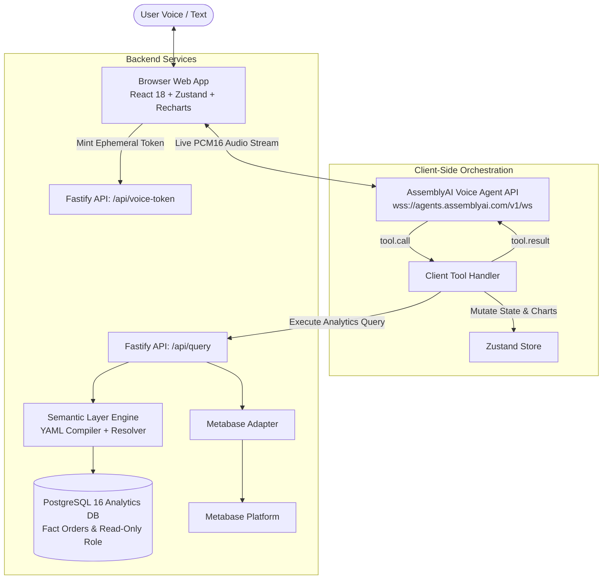

# System Architecture

## Overview
**Talk to Your Data** is an agentic voice-built business intelligence platform. Users speak naturally; charts and analytics dashboards update, filter, and adapt in real time on a live canvas.

## Core Components

### 1. Browser Voice Pipeline
- **Audio Capture**: Captures 24 kHz mono PCM16 audio via `AudioContext` and streams 50ms frames to AssemblyAI WebSocket.
- **Audio Playback**: Jitter-buffered audio output queue with instantaneous barge-in flush upon interruption.
- **Direct WebSocket Connection**: Browser establishes a direct authenticated connection to AssemblyAI Voice Agent API using an ephemeral token minted by the backend.

### 2. Client-Side Tool Calling
- The Voice Agent invokes structured tools (`add_chart`, `update_chart`, `set_global_filter`, etc.).
- The client intercepts `tool.call` events, renders UI state changes immediately for sub-second visual responsiveness, queries the backend semantic API, and returns `tool.result` after `reply.done`.

### 3. Semantic Layer & Query Compiler
- **Strict Allowlisting**: The LLM never writes raw SQL. It produces structured dimensional and metric arguments.
- **Resolver**: Handles synonyms, abbreviations (e.g., "SE" → Southeast), and detects ambiguity (e.g., "south" matching Southeast and Southwest).
- **Compiler**: Parameterized SQL compiler generating deterministic queries against `analytics.fact_orders`.
- **Insight Facts Generator**: Computes deltas, percentages, peak periods, and top dimension shares for conversational responses.
